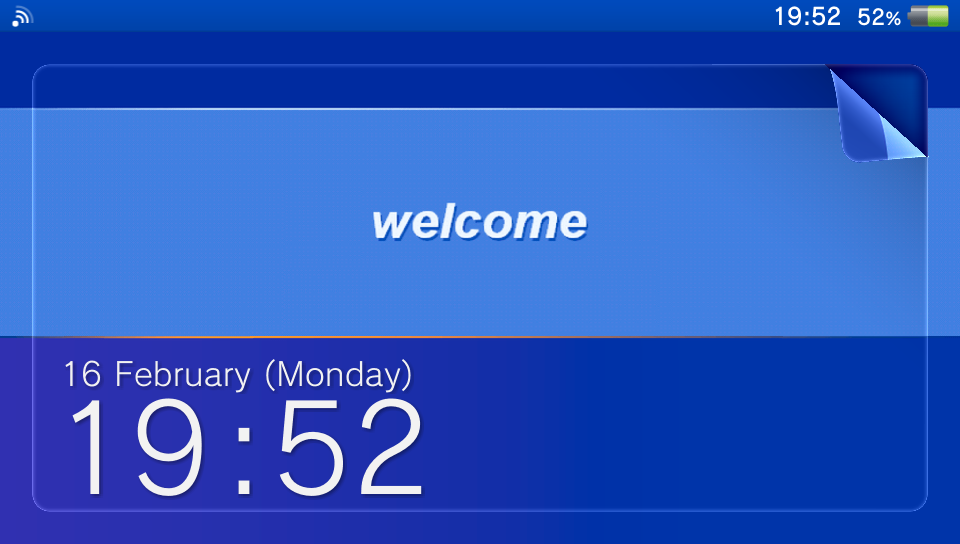
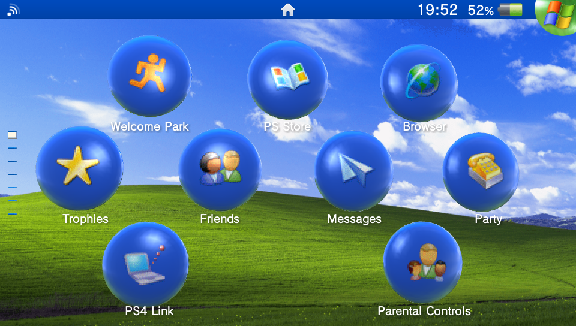

# PS Vita Windows XP Extended Theme

A Windows XP inspired custom theme for the PlayStation Vita.

Unlike standard Vita themes, this project is built using the **Extended Format** for Theme Manager EX. This allows the theme to replace the icons of both official system applications, homebrew apps (such as VitaShell, Adrenaline, PKGj, Apollo Save Tool, and more) and games to match the aesthetics.

## Previews

## Requirements

To use the extended features of this theme, you must have:

1. A modded PS Vita.
2. **Theme Manager EX** installed (Download via [VitaDB](https://www.rinnegatamante.eu/vitadb/#/info/84) or [GameBrew](https://www.gamebrew.org/wiki/Theme_Manager_EX_Vita) or [Bitbucket Source](https://bitbucket.org/kylon/theme-manager-ex-theme-engine)).
3. **"Enable Unsafe Homebrew"** checked in HENkaku Settings.

> ⚠️ **Highly Recommended:** Please consult the [Theme Manager EX Wiki](https://bitbucket.org/kylon/theme-manager-ex-theme-engine/wiki/Home) to understand how Extended Themes function and how to use it.

## Installation

1. Download the theme archive from the **Releases** page.
2. Extract the theme folder from the archive.
3. Open **VitaShell** on your console and connect to your computer via USB or FTP.
4. Copy the extracted theme folder into `ux0:theme/`.
   * *Note: If the `theme` folder does not exist, create it. The final path should look like `ux0:theme/WindowsXP/theme.xml`.*
5. Open **Theme Manager EX** on your PS Vita.
6. Locate the **Windows XP** theme in the list.
   * Press **Triangle** to open the options menu.
   * Select **Install** and press **Cross (X)** to confirm.
7. Once installed, select the theme again and press **Cross (X)** to view details.
8. Press **Square** to **Apply** the theme, then press **Cross (X)** to confirm.
9. Your console will automatically reboot to apply the changes.

## Requests & Suggestions

If you would like an icon added for a specific application or game, or if you have suggestions for improvements, please open an **Issue** on this GitHub repository.

When requesting an icon, please include the application name and its Title ID (e.g., `VITASHELL` or `APOLLO001`) to make the process faster.

## Credits & Resources

This theme was heavily inspired by earlier ports but has been completely rebuilt and remastered. All assets belong to their respective creators and archivers.

* **Icons:** [Windows XP High Resolution Icon Pack](https://github.com/marchmountain/-Windows-XP-High-Resolution-Icon-Pack) by marchmountain.
* **Wallpapers:** [Windows XP HD Wallpaper Pack](https://www.deviantart.com/windowsaesthetics/art/Windows-XP-HD-Wallpaper-Pack-776806652) by windowsaesthetics
* **BGM:** "Velkommen" by Stan LePard, sourced from the [Windows XP Complete Soundtrack Archive](https://archive.org/details/windows-xp-complete-soundtrack).
* **Inspiration / Original Base:** [Windows XP Theme](https://vstema.com/theme/windows_xp) uploaded by StardustWaffles (provider: beautiful-love-resort).
